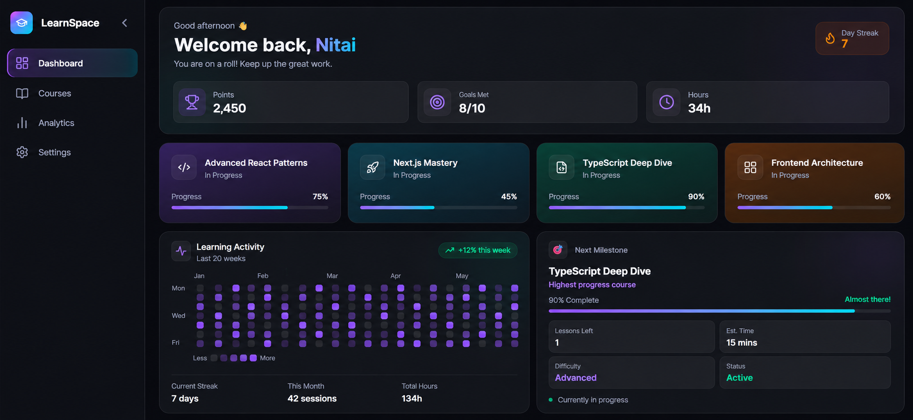

# Student Learning Dashboard

A high-fidelity, animated student dashboard built with Next.js App Router, Supabase, Framer Motion, and Tailwind CSS.

**Live Demo:** https://nextjs-student-dashboard-assignment.vercel.app/

**GitHub:** https://github.com/nitaidalal/nextjs-student-dashboard-assignment

---
## Preview


---
## Tech Stack

- **Framework:** Next.js 15 (App Router)
- **Database:** Supabase (PostgreSQL)
- **Styling:** Tailwind CSS
- **Animations:** Framer Motion
- **Icons:** Lucide React
- **Language:** TypeScript

---

## Architectural Choices

### Bento Grid Layout
The dashboard uses a 4-column CSS Grid on desktop that collapses to 2 columns on tablet and single column on mobile. Each tile is an independent component wrapped in a Framer Motion `motion.div` for staggered entrance animations.

### Component Structure

```
src/
├── app/
│   ├── page.tsx          # Server Component — fetches data
│   ├── loading.tsx       # Skeleton fallback
│   └── error.tsx         # Error boundary
├── components/
│   ├── Sidebar.tsx       # Collapsible nav with layoutId animation
│   ├── HeroTile.tsx      # Welcome + streak tile
│   ├── BentoGrid.tsx     # Grid wrapper with stagger animation
│   ├── CourseCard.tsx    # Dynamic course tile
│   ├── ActivityTile.tsx  # Contribution graph tile
│   ├── ProgressBar.tsx   # Animated progress bar
│   └── SkeletonCard.tsx  # Pulsing skeleton loader
├── lib/
│   └── supabase.ts       # Supabase SSR client
├── types/
│   └── course.ts         # TypeScript interfaces
└── actions/
    └── getCourses.ts     # Server-side data fetch
```

---

## Server / Client Component Split

This was the most important architectural decision in the project.

### Server Components (no "use client")
- `app/page.tsx` — fetches courses from Supabase on the server before anything reaches the browser
- `actions/getCourses.ts` — runs exclusively on the server, keeps Supabase credentials secure
- `lib/supabase.ts` — uses `@supabase/ssr` with Next.js `cookies()` for proper server-side auth
- `components/SkeletonCard.tsx` — pure HTML, no interactivity needed

### Client Components ("use client")
- `BentoGrid.tsx` — uses Framer Motion animations
- `Sidebar.tsx` — uses `useState` for collapse/active state
- `HeroTile.tsx` — uses Framer Motion entrance animations
- `CourseCard.tsx` — uses Framer Motion hover interactions
- `ActivityTile.tsx` — uses Framer Motion staggered cell animations
- `ProgressBar.tsx` — uses Framer Motion width animation
- `error.tsx` — required by Next.js to be a Client Component

### Why this split matters
Fetching data in a Server Component means:
-- Zero client-side loading waterfalls
- Supabase credentials never exposed to the browser
- SEO-friendly rendered HTML

---

## Data Flow

```
Supabase PostgreSQL
       ↓
getCourses.ts (server)
       ↓
page.tsx (Server Component)
       ↓
BentoGrid.tsx (Client Component)
       ↓
CourseCard.tsx × 4 (renders fetched courses)
MilestoneTile (derives highest progress course)
```

---

## Animation Details

All animations use `transform` and `opacity` exclusively — no layout-shifting properties like `width`, `height`, or `margin` are animated directly.

- **Stagger:** `staggerChildren: 0.15` on BentoGrid container
- **Spring physics:** `type: "spring", stiffness: 300, damping: 20` on all hover states
- **layoutId:** Sidebar active indicator slides between nav items using Framer Motion layout animations
- **Progress bar:** Animates from `width: 0%` to fetched value on mount
- **Skeleton:** Pure CSS `animate-pulse` — zero JavaScript overhead during loading

---

## Supabase Setup

### Table Schema

```sql
create table courses (
  id uuid primary key default gen_random_uuid(),
  title text not null,
  progress integer not null,
  icon_name text not null,
  created_at timestamp default now()
);
```

### Seed Data

```sql
insert into courses (title, progress, icon_name)
values
  ('Advanced React Patterns', 75, 'Code2'),
  ('Next.js Mastery', 45, 'Rocket'),
  ('TypeScript Deep Dive', 90, 'FileCode'),
  ('Frontend Architecture', 60, 'LayoutDashboard');
```

---

## Environment Variables

```
NEXT_PUBLIC_SUPABASE_URL=your_supabase_project_url
NEXT_PUBLIC_SUPABASE_ANON_KEY=your_supabase_anon_key
```


---

## Responsive Design

| Breakpoint | Layout |
|---|---|
| Desktop > 1024px | Full sidebar + 4 column bento grid |
| Tablet 768–1024px | Icon-only sidebar + 2 column grid |
| Mobile < 768px | Bottom navigation bar + single column |

---

## Challenges Faced

### 1. Hydration Mismatch
The `ActivityTile` contribution graph used `Math.random()` to generate data. Since Next.js renders on the server first, the random values on server and client were different, causing a React hydration error. Fixed by replacing `Math.random()` with static hardcoded seed data so server and client always produce identical HTML.

### 2. Supabase SSR vs Standard Client
The standard `@supabase/supabase-js` client doesn't handle Next.js cookies correctly in Server Components. Used `@supabase/ssr` with `createServerClient` and the Next.js `cookies()` API to properly initialize the client server-side.

### 3. Sidebar Scroll
The sidebar was scrolling with the page content instead of staying fixed. Fixed by changing the root layout wrapper from `min-h-screen` to `h-screen overflow-hidden`, which locks the viewport height and forces only the main content area to scroll independently.

---

## Performance Optimizations

- Server Components eliminate client-side data fetching waterfalls
- Framer Motion animations use GPU-accelerated `transform` and `opacity` only
- Skeleton loader uses pure CSS animation — no JavaScript during load
- Images and icons are SVG-based — no network requests for assets
- Supabase query uses `.order()` for consistent, predictable results

---

## Getting Started

```bash
# Clone the repo
git clone https://github.com/your-username/nextjs-student-dashboard

# Install dependencies
cd nextjs-student-dashboard
npm install

# Add environment variables
cp .env.example .env.local
# Fill in your Supabase URL and anon key

# Run development server
npm run dev
```

Open [http://localhost:3000](http://localhost:3000) in your browser.

---

## Deployment

Deployed on Vercel. 

[](https://vercel.com/new)